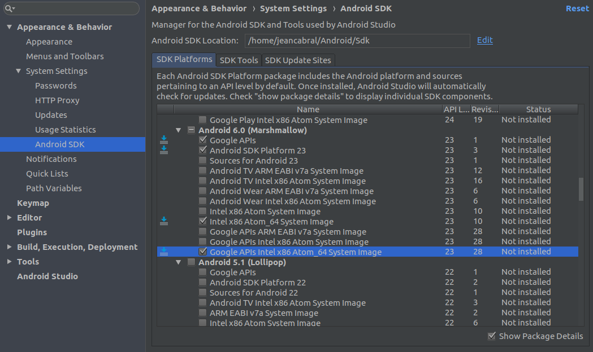

# Exemplo teste *end-to-end* no React Native com Appium

Este projeto tem como finalidade realizar um exemplo de funcionamento de teste *end-to-end* com *Appium* em aplicações móveis desenvolvidos em *React Native*.

## Ferramentas Necessárias 

### 1. NodeJS

Como o React Native é um framework em JavaScript, é necessário que você tenha o Nodejs instalado. 

* [Instalação no Linux](https://medium.com/@jeancabral/ambiente-para-o-desenvolvimento-de-node-js-com-nvm-no-ubuntu-18-04-c636db90f998)

* [Instalação no Windows](https://nodejs.org/en/download/)

### 2. JDK

Geralmente, aplicativos nativos para Android são criados em Java. Então Java Development Kit é necessário. Execute no Terminal. Para este projeto é necessário a versão 8 do Java.

```sh 
sudo add-apt-repository ppa:openjdk-r/ppa
sudo apt update
sudo apt install openjdk-8-jdk
```

### 3. Android Studio

Para o desenvolvimento Android no React Native é necessário ter o Android Studio instalado. Para a instalação no *Windows* e *Linux*, siga o tutorial do [Android Studio](https://developer.android.com/studio/install?hl=pt-br#64bit-libs)

### 4. Android SDK

O desenvolvimento em React Native com código nativo, requer o SDK do Android versão 6.0 (Marshmallow) com requisito. SDKs adicionais para Android podem ser instalados por meio do SDK Manager no Android Studio.

O SDK Manager pode ser acessado na tela Bem-vindo ao Android Studio. Clique em Configure e selecione SDK Manager.


Em seguida, marque a caixa ao lado de “Show Packages Details” no canto inferior direito. Procure na lista por Android 6.0 (Marshmallow) e verifique se os itens a seguir estão marcados:
* Google APIs
* Android SDK Platform 23
* Intel x86 Atom_64 System Image
* Google APIs Intel x86 Atom_64 System Image



Clique em Apply e depois Ok, na tela de confirmação, para instalar as dependências.

### 5. Configurando a variável de ambiente ANDROID_HOME

As ferramentas React Native exigem que algumas variáveis de ambiente sejam configuradas para criar aplicativos com código nativo.

No terminal e abra o arquivo:

`sudo nano ~/.bashrc`

Copie e cole as seguintes linhas no final do arquivo.

```
export ANDROID_HOME=$HOME/Android/Sdk
export PATH=$PATH:$ANDROID_HOME/emulator
export PATH=$PATH:$ANDROID_HOME/tools
export PATH=$PATH:$ANDROID_HOME/tools/bin
export PATH=$PATH:$ANDROID_HOME/platform-tools
```

Após as alterações para salvar e sair do Editor:
* Pressione Ctrl + O (Gravar)
* Pressione Enter
* Pressione Ctrl + x (Sair do Editor)

### 6. React Native CLI

CLI que significa command-line interface (interface de linha de comando), ele é resumidamente uma interface que suporta passagem de parâmetros via linha de comando em terminais e/ou semelhantes.

Para instalar o React Native CLI podemos usar o npm. No terminal, execute o comando:

`npm install -g react-native-cli`

Agora que temos o React Native CLI devidamente instalado, podemos executar no projeto.

## Executando o projeto *React Native*.

1. Abra o terminal e execute na pasta raiz do projeto e execute: `npm install` ;
2. Após ter instalado todas as dependẽncias, nesse mesmo terminal execute `react-native start`, este comando estará iniciando o *react native*;
3. Com o *react native* iniciado é necessário executar o projeto no emulador Android, para isso, abra outro terminal na pasta raiz do projeto e execute `react-native run-android`.

Após a execução desses três passos vamos iniciar os testes automátizados.

## Executando os testes automatizados.

1. Em um terminal separado dos utilizados no passo da execução do projeto, entre no diretório `test` e execute o comando `npm install`;
2. Após a instalação das dependências para a execução, execute o comando `appium` para que se inicialize a ferramenta Appium.
3. Após o passo anterior, em outro terminal, no diretório `test` execute o comando `npx wdio ./wdio.conf.js` que é utilizado para executar as configurações dos testes automatizados, apontando qual o emulador que deverá ser utilizado, na seção abaixo é explicado o arquivo `wdio.conf.js`

## Funcionando do arquivo `wdio.conf.js`

O arquivo `wdio.conf.js` aponta as configurações para serem executados os testes automatizados, esses apontamentos são:

```javascript
exports.config = {
    services: ['appium'],
    port: 4723,
    runner: 'local',
    specs: [
        './specs/**/*.js'
    ],
    capabilities: [{
        maxInstances: 1, // máximo de instâncias que podem ser executados
        browserName: '',
        appiumVersion: '1.13.0', // versão do appium
        platformName: 'Android', // plataforma que será executado
        platformVersion: '10.0', // versão do Android
        deviceName: 'pixel_2_xl', // nome do aparelho (emulado)
        app: '../android/app/build/outputs/apk/debug/app-debug.apk', // onde se encontra o apk do projeto
        automationName: 'UiAutomator2' // nome de sua automação
    }],
}
```

## Como o Appium encontra os elementos?

Para este projeto utilizei o atributo de `tag` `accessibilityLabel` na qual nos testes eles podem ser referenciados desta forma `$('~username')`, por exemplo.

arquivo App.js
```javascript
<TextInput name="username" accessibilityLabel="username" style={LOCAL_STYLES.input} onChangeText={(text) => this.inputChangeHandler(text, "username")} />
```

Desta forma nos testes é referenciado:
```javascript
$('~username').setValue("joao");
```

Para testes em dispositivos Apple é utilizado a propriedade de `tag` `testID`.

Na documentação do [Appium](http://appium.io/docs/en/about-appium/intro/), encontra-se mais exemplos de como se desenvolver os testes.


## Referências


- [React Native documentação](https://reactnative.dev/docs/getting-started)
- [Appium documentação](http://appium.io/docs/en/about-appium/intro/)
